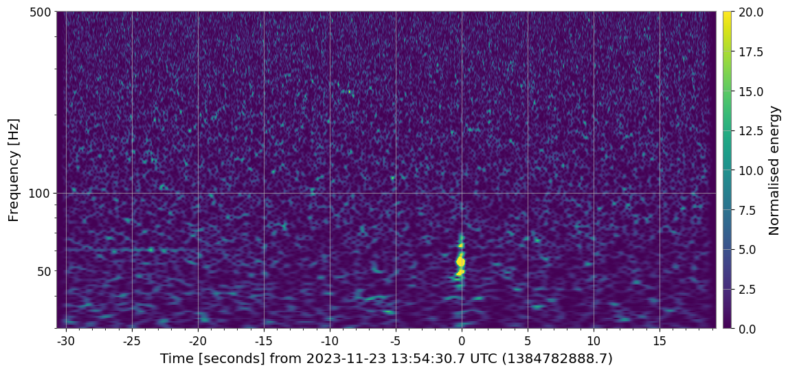

# Hello world!

This is the codebase for Noah Hughes and Via Weber's work on studying gaps in the mass spectrum of binary black hole mergers (BBH) and other aspects of the coalescence of binary compact comsomological systems (CBC).

This code is written in Python and requires and initial installation of required files. Please execute "bash install_packages.sh" before attempting to run any Python files.

